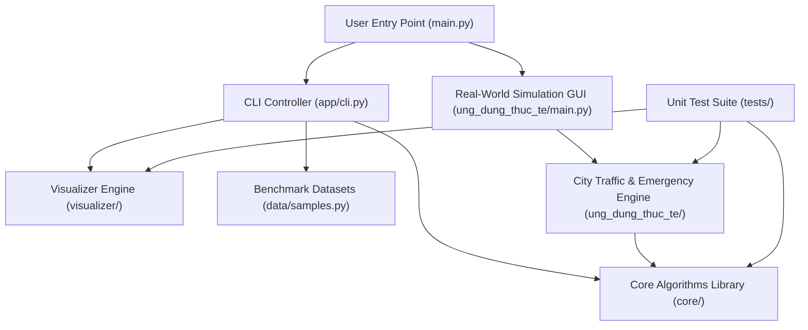

# 📘 TÀI LIỆU REVIEW TOÀN BỘ MÃ NGUỒN & KIẾN TRÚC HỆ THỐNG
> **Đồ Án Môn Học:** Cấu Trúc Rời Rạc & Lý Thuyết Đồ Thị  
> **Đơn vị:** Trường Đại học Giao thông vận tải TP.HCM (UTH) - Khoa Công Nghệ Thông Tin  
> **Giảng viên hướng dẫn:** Thầy Tăng Lê Ngọc Gia Huy  
> **Mục đích tài liệu:** Lưu trữ toàn bộ tri thức kỹ thuật, kiến trúc module, nguyên lý thuật toán và ánh xạ dữ liệu của dự án. File này được dùng làm bản tra cứu ngữ cảnh hoàn chỉnh (Single Source of Truth) cho các lần xử lý và mở rộng tiếp theo.

---

## 🗺️ 1. TỔNG QUAN HỆ THỐNG & KIẾN TRÚC TỔNG THỂ

Dự án được thiết kế theo mô hình phân tầng chặt chẽ (Layered Architecture), 100% thuật toán nền tảng được tự cài đặt từ đầu (không sử dụng thư viện đồ thị ngoài như `networkx` cho logic giải thuật), chia thành 4 phân tầng chính:



### Bảng phân tầng trách nhiệm (Module Responsibilities)

| Tầng | Thư mục | Trách nhiệm chính |
| :--- | :--- | :--- |
| **Khởi chạy** | `main.py` | Điểm vào duy nhất; phân nhánh thực thi giữa chế độ CLI 10 chức năng hoặc Sa bàn GUI Pygame. |
| **Thuật toán lõi** | `core/` | 100% thuật toán đồ thị thuần: Lưu trữ, chuyển đổi biểu diễn, BFS/DFS, 2-Coloring, Dijkstra, Bellman-Ford, Fleury, Hierholzer, Prim, Kruskal, Ford-Fulkerson. |
| **Giao diện CLI** | `app/cli.py` | Menu dòng lệnh tương tác 10 chức năng chuẩn đề bài, xuất bảng vết (trace table) đối chiếu giải tay, gọi vẽ đồ thị. |
| **Trực quan hóa** | `visualizer/` | Bố cục thông minh (smart concentric / spring layout), kết xuất file ảnh PNG và hoạt ảnh GIF từng bước duyệt. |
| **Sa bàn thực tế** | `ung_dung_thuc_te/` | Sa bàn đồ họa Pygame mô phỏng lưới giao thông 37 nút - 72 tuyến đường khu vực Bình Thạnh - UTH, điều phối xe cứu hộ khẩn cấp bằng BFS và định tuyến động bằng Dijkstra. |
| **Dữ liệu mẫu** | `data/` | Các bộ đồ thị mẫu benchmark kinh điển (đồ thị 20 đỉnh vô hướng/có hướng, ngôi nhà Euler, mạng luồng, cây khung). |
| **Kiểm thử** | `tests/` | Bộ kiểm thử tự động 33+ test cases bao phủ toàn bộ chức năng cốt lõi và tích hợp. |

---

## 🧠 2. CHI TIẾT CÁC MODULE THUẬT TOÁN CỐT LÕI (`core/`)

### 2.1. `core/graph.py` — Đối tượng Đồ thị trung tâm (`Graph`)
- **Vai trò:** Quản lý đối tượng đồ thị $G = (V, E)$, hỗ trợ cả đồ thị vô hướng/có hướng, có trọng số/không trọng số.
- **Tính năng đồng bộ tự động:** Khi nạp dữ liệu từ một dạng bất kỳ, lớp tự động tính toán và duy trì đồng thời cả 3 dạng biểu diễn:
  1. `self.matrix`: Ma trận kề $n \times n$ (truy xuất tức thời trọng số cạnh $O(1)$ cho Ford-Fulkerson).
  2. `self.adj`: Danh sách kề dạng `dict {u: [(v, w), ...]}` (duyệt lân cận tối ưu $O(\text{deg}(u))$ cho BFS, DFS, Dijkstra).
  3. `self.edges`: Danh sách cạnh dạng `list [(u, v, w), ...]` (quét toàn bộ cạnh cho Kruskal, Bellman-Ford).
- **Bộ phân tích cú pháp (Parsers):**
  - `from_matrix(matrix)`: Nhận ma trận vuông $n \times n$.
  - `from_edges(edges, n=None)`: Nhận danh sách cạnh, tự động suy diễn $n = \max(\text{node}) + 1$ nếu $n$ không được truyền vào.
  - `from_text(text)`: Tự động nhận diện định dạng text: nếu dòng đầu là 1 số nguyên đơn lẻ $\rightarrow$ nạp dạng ma trận; nếu mỗi dòng gồm 2-3 số $\rightarrow$ nạp dạng danh sách cạnh.

### 2.2. `core/converter.py` — 6 Hàm chuyển đổi biểu diễn đồ thị
Cung cấp 6 hàm chuyển đổi 2 chiều giữa Ma trận kề, Danh sách kề và Danh sách cạnh:
1. `matrix_to_adj(matrix, directed)`: $O(V^2)$ — Duyệt ma trận, thêm lân cận khi $M[i][j] \ne 0$.
2. `matrix_to_edges(matrix, directed)`: $O(V^2)$ — Nếu vô hướng, chỉ quét tam giác trên ($j \ge i$) để tránh nhân đôi cạnh.
3. `edges_to_matrix(edges, n, directed)`: $O(V^2 + E)$ — Gán $M[u][v] = w$, nếu vô hướng gán đối xứng $M[v][u] = w$.
4. `edges_to_adj(edges, n, directed)`: $O(V + E)$ — Thêm $(v, w)$ vào `adj[u]`, nếu vô hướng thêm $(u, w)$ vào `adj[v]`.
5. `adj_to_matrix(adj, n)`: $O(V^2 + E)$ — Chuyển từ từ điển danh sách kề sang ma trận $n \times n$.
6. `adj_to_edges(adj, directed)`: $O(V + E)$ — Lọc chống trùng lặp cạnh vô hướng bằng điều kiện $u \le v$.

### 2.3. `core/traversal.py` — Duyệt đồ thị (BFS & DFS)
- **Quy ước chuẩn mực:** Khi duyệt các đỉnh lân cận, luôn sắp xếp danh sách đỉnh kề theo thứ tự tăng dần (`sorted`) để đảm bảo kết quả trùng khớp 100% với bài giải tay trên giấy của sinh viên.
- **BFS (`bfs(adj, n, start, record_trace=True)`):**
  - Cấu trúc: Hàng đợi FIFO (`queue`).
  - Đầu ra: `order` (thứ tự duyệt), `tree_edges` (các cạnh tạo thành cây khung BFS), `trace_table` (trạng thái hàng đợi và mảng `visited` qua từng bước).
- **DFS (`dfs(adj, n, start)`):**
  - Cấu trúc: Đệ quy Call Stack (hoặc ngăn xếp).
  - Đầu ra: `order`, `tree_edges` (các cạnh cây khung DFS), `trace_table`.

### 2.4. `core/bipartite.py` — Kiểm tra Đồ thị Hai phía & Trích xuất Chu trình lẻ
- **Nguyên lý:** Đồ thị là 2 phía khi và chỉ khi không chứa chu trình có độ dài lẻ (Định lý König).
- **Thuật toán:** Tô 2 màu bằng BFS (màu $1$ và màu $-1$). Xử lý đồ thị nhiều thành phần liên thông bằng vòng lặp bao ngoài.
- **Kỹ thuật trích xuất Chu trình lẻ (Odd Cycle):**
  - Khi gặp cạnh $(u, v)$ có `color[u] == color[v]`, thuật toán lần ngược mảng `parent` từ cả $u$ và $v$ về gốc cây BFS để tìm **Tổ tiên chung gần nhất (LCA - Lowest Common Ancestor)**.
  - Ghép hai đoạn đường đi $u \rightarrow \text{LCA}$ và $\text{LCA} \rightarrow v$ cùng cạnh $(v, u)$ để tạo thành chu trình độ dài lẻ, làm bằng chứng phản bác tính hai phía.

### 2.5. `core/shortest_path.py` — Đường đi ngắn nhất (Dijkstra & Bellman-Ford)
- **Dijkstra (`dijkstra(adj, n, start, end=None)`):**
  - Điều kiện: Trọng số không âm ($w \ge 0$).
  - Thuật toán tham lam: Tại mỗi bước chọn đỉnh $u^* \notin \text{visited}$ có $\text{dist}[u^*]$ nhỏ nhất, chốt nhãn vĩnh viễn và thực hiện nới lỏng (relaxation) các đỉnh kề.
  - Hỗ trợ dừng sớm khi đã chốt đỉnh `end`.
  - Xuất bảng vết `trace` chứa snapshot mảng `dist` và `parent` để hiển thị ma trận bước lặp.
- **Bellman-Ford (`bellman_ford(edges, n, start, directed=False, end=None)`):**
  - Điều kiện: Áp dụng được cho đồ thị có trọng số âm ($w < 0$).
  - Thuật toán: Lặp relaxation $n-1$ vòng trên toàn bộ tập cạnh. Có cơ chế dừng sớm nếu qua 1 vòng không có khoảng cách nào được nới lỏng thêm.
  - Phát hiện chu trình âm: Lặp vòng thứ $n$, nếu vẫn còn cạnh $(u, v)$ thỏa $\text{dist}[u] + w < \text{dist}[v]$ thì kết luận tồn tại chu trình âm (`has_negative_cycle = True`).

### 2.6. `core/euler.py` — Chu trình & Đường đi Euler (Fleury & Hierholzer)
- **Kiểm tra tính Euler (`check_eulerian`):**
  - Vô hướng: Đồ thị liên thông giữa các đỉnh bậc $> 0$. Chu trình Euler $\iff 0$ đỉnh bậc lẻ; Đường đi Euler $\iff$ đúng 2 đỉnh bậc lẻ.
  - Có hướng: Đồ thị liên thông yếu giữa các đỉnh có cung. Chu trình Euler $\iff \text{in\_deg}(v) = \text{out\_deg}(v), \forall v$; Đường đi Euler $\iff 1$ đỉnh có $\text{out} = \text{in} + 1$, $1$ đỉnh có $\text{in} = \text{out} + 1$, các đỉnh còn lại cân bằng.
- **Fleury (`fleury`):**
  - Nguyên tắc: "Không bao giờ đi qua cạnh cầu trừ khi không còn lựa chọn nào khác".
  - Kiểm tra cạnh cầu (`is_bridge`): Sử dụng BFS đếm số lượng đỉnh liên thông trước và sau khi tạm thời xóa cạnh. Độ phức tạp $O(E^2)$.
- **Hierholzer (`hierholzer`):**
  - Nguyên tắc: Ghép chu trình con bằng Stack.
  - Độ phức tạp tối ưu: $O(E)$. Khi đỉnh trên đỉnh stack hết cạnh kề, đỉnh được pop ra đưa vào chu trình. Đảo ngược mảng kết quả để thu được lộ trình đúng.

### 2.7. `core/mst.py` — Cây khung nhỏ nhất & Cấu trúc DSU
- **Lớp `DSU` (Disjoint Set Union):**
  - `find(i)`: Tìm đại diện tập hợp, áp dụng **Nén đường đi (Path Compression)** trỏ trực tiếp về gốc.
  - `union(i, j)`: Hợp nhất 2 tập hợp, áp dụng **Gộp theo hạng (Union by Rank)** để cây luôn cân bằng.
- **Kruskal (`kruskal(edges, n)`):**
  - Sắp xếp cạnh theo trọng số tăng dần.
  - Dùng DSU kết nạp các cạnh không tạo chu trình cho tới khi đủ $n-1$ cạnh. Độ phức tạp $O(E \log E)$.
- **Prim (`prim(adj, n, start=0)`):**
  - Áp dụng nguyên lý lát cắt (Cut Property): Xuất phát từ 1 đỉnh, tại mỗi bước chọn cạnh nhẹ nhất nối giữa tập đỉnh đã kết nạp và tập đỉnh chưa kết nạp.

### 2.8. `core/max_flow.py` — Luồng cực đại & Lát cắt hẹp nhất
- **Thuật toán Edmonds-Karp (`ford_fulkerson(edges, n, source, sink)`):**
  - Dùng BFS tìm đường tăng luồng ngắn nhất (số cạnh ít nhất) trên đồ thị phần dư `residual`.
  - Tìm độ rộng nghẽn cổ chai: $\text{bottleneck} = \min_{(u, v)} \text{residual}[u][v]$.
  - Cập nhật đồ thị phần dư: giảm cung thuận $(u \rightarrow v)$ và tăng cung nghịch $(v \rightarrow u)$ đúng bằng `bottleneck` (cho phép hủy/chuyển hướng luồng).
- **Xác định Lát cắt hẹp nhất (Min-Cut $S - T$):**
  - Dùng BFS trên đồ thị phần dư cuối cùng từ Source $S$, tập các đỉnh còn đến được là $S_{\text{set}}$, phần còn lại là $T_{\text{set}}$.
  - Các cạnh ban đầu đi từ $S_{\text{set}}$ sang $T_{\text{set}}$ chính là các cạnh thuộc lát cắt hẹp nhất có dung lượng bằng đúng giá trị Max Flow (Định lý Max-Flow Min-Cut).

---

## 🎨 3. MODULE TRỰC QUAN HÓA (`visualizer/`)

### 3.1. `visualizer/draw.py`
- `compute_smart_layout(g_or_n)`:
  - Nếu đồ thị có tập cạnh và cài đặt `networkx`, sử dụng Spring Layout với lực hút tỷ lệ nghịch với trọng số cạnh để cạnh trọng số lớn vẽ dài hơn, cạnh nhỏ vẽ ngắn hơn.
  - Fallback: Bố cục hình tròn đồng tâm (Concentric Circles) nhiều tầng (áp dụng cho đồ thị $N=8, 15, 20, 30$).
- `draw(...)`: Vẽ đồ thị tổng quát, làm nổi bật đường đi (highlight), vẽ mũi tên có hướng hoặc đường vô hướng, hỗ trợ độ dày nét vẽ động theo trọng số: $\text{lw} \propto \sqrt{w}$.
- Các hàm chuyên biệt: `draw_euler` (vẽ số thứ tự bước đi trên từng cạnh), `draw_mst` (vẽ cây khung màu xanh đậm, nét đứt mờ cho cạnh loại bỏ), `draw_max_flow` (vẽ nhãn `flow/capacity`, highlight cạnh bão hòa và lát cắt).

### 3.2. `visualizer/animation.py`
- `animate_dfs(g, start)` & `animate_bfs(g, start)`:
  - Sinh chuỗi khung hình (frames) từng bước của thuật toán: đỉnh đang xét, cạnh kích hoạt, trạng thái Stack/Queue, mảng `visited`.
  - Sử dụng `matplotlib.animation.FuncAnimation`. Hỗ trợ xuất trực tiếp ra file ảnh động GIF (dùng Pillow Writer) và lưu vào thư mục `results/`.

---

## 🚦 4. SA BÀN ĐIỀU PHỐI GIAO THÔNG THÔNG MINH (`ung_dung_thuc_te/`)

### 4.1. Bản đồ & Dữ liệu Nút giao (`city_graph.py`)
- Mô phỏng thực tế khu vực Quận Bình Thạnh & Trường ĐH Giao thông vận tải TP.HCM (UTH).
- Gồm **37 nút giao** (`CITY_NODES`) và **72 tuyến đường** (`CITY_EDGES`):
  - Trụ sở & Trường học: UTH (CS1 Võ Oanh), FTU2 (D5), HUTECH, UEF...
  - Nút giao trọng điểm: Ngã tư Hàng Xanh, Vòng xoay Điện Biên Phủ, Ngã ba Ung Văn Khiêm - D2, Ngã 4 Bạch Đằng - Đinh Bộ Lĩnh...
  - Bệnh viện & Cứu hỏa: BV Nhân Dân Gia Định, BV Quốc Tế Vinmec, PCCC Bình Thạnh (đầy đủ thông số xe trực sẵn `fleet` và xe đang bận `busy`).
  - Tuyến đường 1 chiều thực tế: Đinh Bộ Lĩnh, Xô Viết Nghệ Tĩnh, Bạch Đằng, Ung Văn Khiêm, D2, D5...

### 4.2. Mô hình Toán học Giao thông Động (`city_data_model.py`)
- Công thức trọng số thích ứng tình trạng ùn tắc thời gian thực:
  $$\text{Weight}(u, v) = \text{Length}(u, v) \times [1.0 + \text{JamLevel}(u, v) \times 2.5]$$
  - $\text{JamLevel} \in [0.0, 1.0]$: Mức độ tắc đường (0: thông thoáng, 1: kẹt xe nghiêm trọng).
  - Trọng số cạnh bị nghẽn có thể tăng tối đa gấp $3.5$ lần so với chiều dài thực tế, buộc Dijkstra tìm lộ trình vòng thông thoáng hơn.
- Sự cố phong tỏa (`is_blocked`): Trọng số tiến tới vô cực ($\infty$), ngắt hoàn toàn lưu thông.

### 4.3. Bộ điều phối Cứu hộ BFS (`dispatcher.py`)
- **BFS Quét Đa tầng (Multi-Layer Wave Search):**
  - Khi có sự cố tại nút tai nạn, thuật toán quét loang theo từng tầng bán kính topo ($L_0, L_1, L_2, \dots$) để phát hiện cơ sở cứu hộ gần nhất có xe rảnh (`busy < fleet`).
  - Hỗ trợ các kịch bản: `MEDICAL` (tìm Bệnh viện), `FIRE` (tìm Trạm PCCC), `DUAL` (tìm đồng thời cả Bệnh viện và Trạm PCCC gần nhất).
  - Sau khi chốt được trạm, tự động kích hoạt Dijkstra dẫn đường từ trạm đến hiện trường.

### 4.4. Bộ định tuyến Lộ trình Tối ưu & Dự phòng (`router.py`)
- **Dijkstra từng bước chuẩn CTRR:** Ghi nhận đầy đủ chuỗi sự kiện lựa chọn tham lam $u^* = \arg\min d[u]$ và bảng ma trận bước lặp nới lỏng cạnh.
- **Sinh 3 Lộ trình ứng viên (Candidate Routes) bằng Phương pháp Phạt trọng số cạnh (Penalty Method):**
  1. *Tuyến chính (Primary Route):* Chạy Dijkstra trên đồ thị trọng số hiện tại.
  2. *Tuyến dự phòng 1 & 2 (Backup Routes):* Tăng phạt trọng số các cạnh đã sử dụng trong tuyến trước lên $1.8 \times$ hoặc $2.5 \times$, sau đó chạy lại Dijkstra để tìm các lộ trình độc lập thay thế.

### 4.5. Các giải thuật nâng cao trên Sa bàn (`traffic_algorithms.py`)
- **Bẻ cua tại Điểm gãy (Breakpoint Detour):** Khi xe đang trên đường đi mà cung tiếp theo đột ngột bị chặn, nút hiện tại của xe trở thành Pivot Node, thuật toán tính lại đường vòng từ Pivot Node đến đích.
- **Thuật toán Tarjan (DFS):** Tìm các Cầu độc đạo (Bridges) và Khớp giao thông (Cut Vertices) để phát hiện các "điểm nghẽn chí mạng" có nguy cơ chia cắt mạng lưới giao thông đô thị.
- **Kruskal Cáp quang Giao thông:** Quy hoạch cây khung nhỏ nhất nối toàn bộ các tủ điều khiển đèn tín hiệu giao thông với tổng chiều dài cáp quang tối thiểu.

### 4.6. Giao diện Đồ họa Pygame (`traffic_dashboard.py`, `hud.py`, `vehicle.py`)
- Render bản đồ độ nét cao (1280x720): Phân chia vùng Bản đồ (Map Canvas 950px) và Bảng điều khiển (HUD Panel 330px).
- Động lực học phương tiện mượt mà (smooth lerp interpolation) với góc quay đầu xe theo hướng di chuyển.
- Tích hợp Menu tròn (Radial Menu) tương tác nhanh tại từng nút giao, biểu đồ radar mức độ nghẽn và timeline sự cố.

---

## 🧪 5. BẢN ĐỒ KIỂM THỬ TỰ ĐỘNG (`tests/`)

Bộ kiểm thử gồm 33+ test cases sử dụng `unittest` chuẩn của Python:

| File kiểm thử | Đối tượng kiểm tra chính |
| :--- | :--- |
| `test_foundation.py` | Kiểm thử khởi tạo lớp `Graph`, 6 hàm chuyển đổi trong `converter.py`, tính bảo toàn cấu trúc và trọng số. |
| `test_traversal.py` | Kiểm thử BFS và DFS, thứ tự duyệt theo thứ tự đỉnh tăng dần, tính đúng đắn của cây khung và bảng vết. |
| `test_bipartite.py` | Kiểm thử kiểm tra đồ thị 2 phía trên chu trình chẵn $C_4$ và trích xuất chu trình lẻ trên chu trình lẻ $C_3$. |
| `test_shortest_path.py` | Kiểm thử Dijkstra trên đồ thị trọng số dương, Bellman-Ford trên đồ thị có trọng số âm và phát hiện chu trình âm. |
| `test_euler.py` | Kiểm thử điều kiện Euler, thuật toán Fleury và thuật toán Hierholzer trên đồ thị có hướng và vô hướng. |
| `test_mst.py` | Kiểm thử DSU (nén đường đi & rank), Kruskal và Prim trên đồ thị có trọng số. |
| `test_max_flow.py` | Kiểm thử Edmonds-Karp Max Flow, tính bảo toàn luồng và định lý Max-Flow Min-Cut. |
| `test_traffic_sim.py` | Kiểm thử ma trận trọng số động, công thức phạt kẹt xe, các thuật toán Tarjan và Kruskal sa bàn. |
| `test_emergency_dispatch.py` | Kiểm thử BFS quét đa tầng tìm trạm cấp cứu/PCCC và tính toán lộ trình cứu hộ. |
| `test_robot_storyline.py` | Kiểm thử tính tương thích ngược của kịch bản mô phỏng. |
| `test_draw.py` & `test_pygame_smoke.py` | Smoke test kiểm tra không vỡ layout khi vẽ đồ thị Matplotlib và khởi tạo môi trường đồ họa. |

**Lệnh thực thi toàn bộ test:**
```powershell
$env:PYTHONUTF8=1; .\.venv\Scripts\python.exe -m unittest discover tests
```

---

## 📌 6. HƯỚNG DẪN TRA CỨU NHANH CHO AI AGENT TRONG CÁC PHIÊN TIẾP THEO

Khi nhận được yêu cầu mới liên quan đến dự án, Agent chỉ cần thực hiện các bước tra cứu sau:
1. **Nếu liên quan đến thuật toán lý thuyết đồ thị:** Xem ngay mục 2 của file này và mã nguồn tương ứng trong `core/`.
2. **Nếu liên quan đến Menu dòng lệnh hoặc định dạng xuất bảng vết:** Xem mục 2.3, 2.5 và `app/cli.py`.
3. **Nếu liên quan đến Sa bàn giao thông thông minh Pygame:** Xem mục 4 của file này và các file trong `ung_dung_thuc_te/`.
4. **Nếu liên quan đến cấu trúc dữ liệu đồ thị mẫu:** Xem `data/samples.py` và `ung_dung_thuc_te/city_graph.py`.
5. **Quy tắc bảo trì mã nguồn:**
   - Tuyệt đối giữ cho 3 dạng biểu diễn trong `Graph` luôn đồng bộ.
   - Luôn sắp xếp đỉnh kề tăng dần trong duyệt đồ thị để đảm bảo kết quả trùng khớp bài thi/giải tay.
   - Chú thích mã nguồn luôn ở dạng ngắn gọn, súc tích, tập trung vào bản chất giải thuật và quyết định thiết kế thay vì chú thích hiển nhiên từng dòng code.
